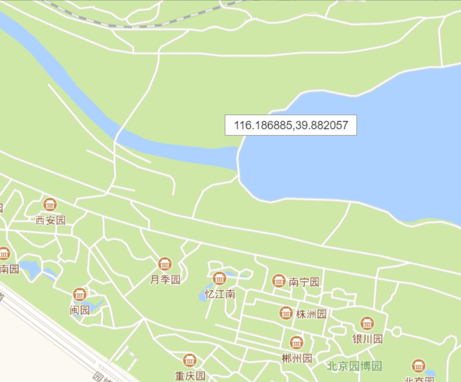
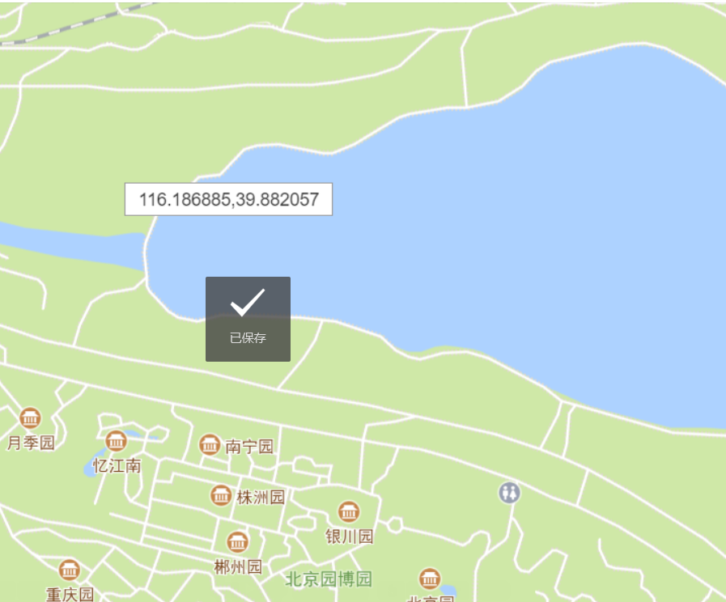
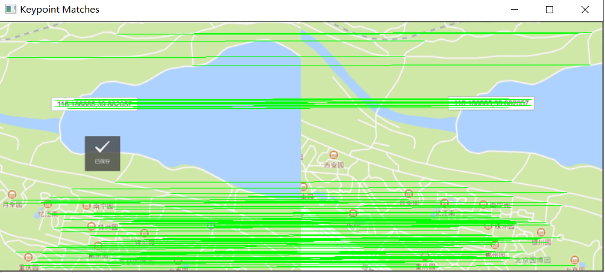
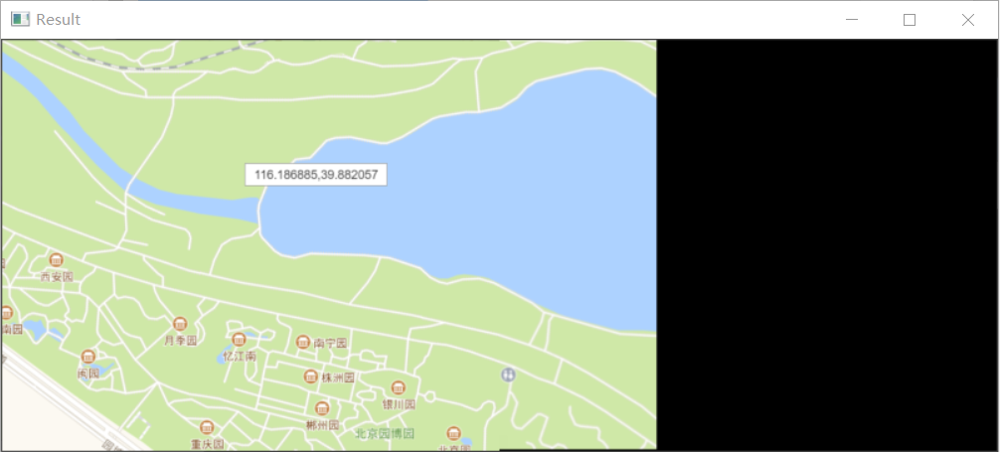
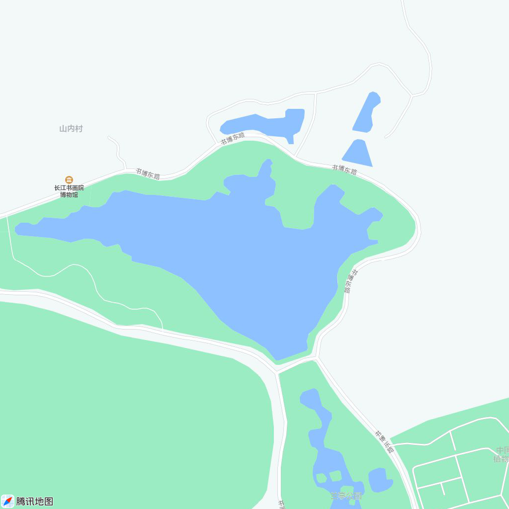
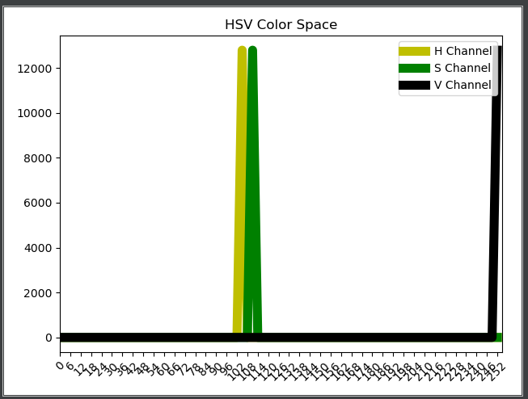
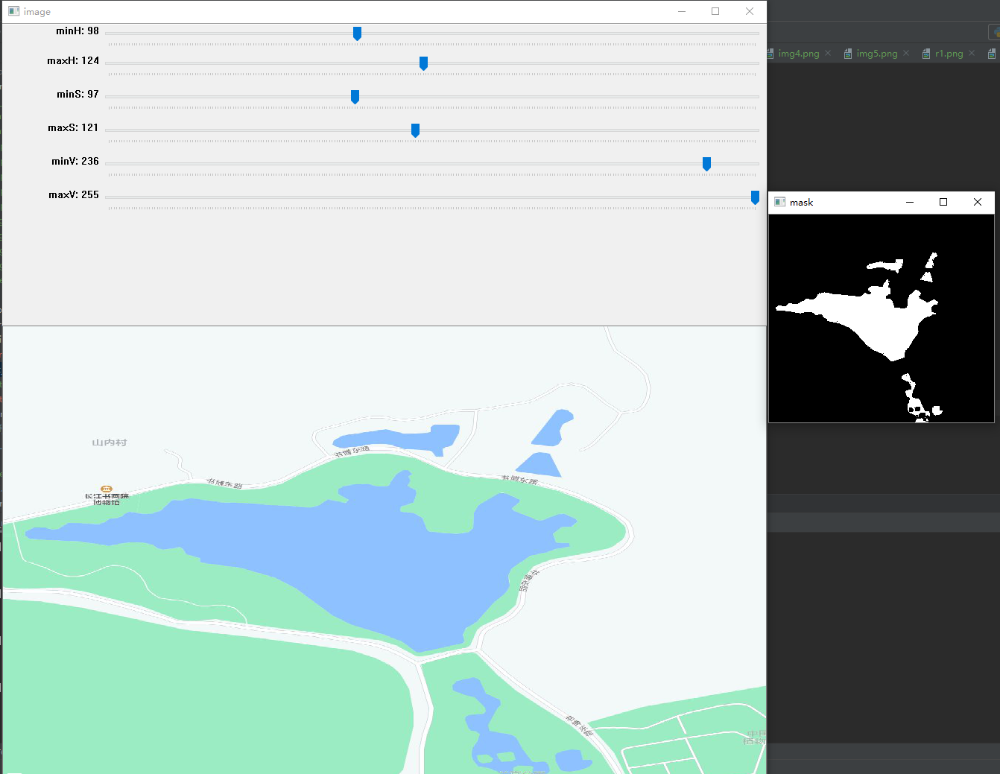

# cvUtils
opencv 工具函数
`dsa`
## 拼接图片
./concateImg/simple_concate.py
图片 1

图片 2

拼接使用特征点

拼接结果

## 选择图片中目标颜色区域
./selectRoi/select_roi_hsv.py
原始图片

第一步 选择需要分割出湖泊区域

第二步 分析选择区域图片HSV分布

第三步 调节HSV阈值观察mask区域是否较好分割出目标区域
